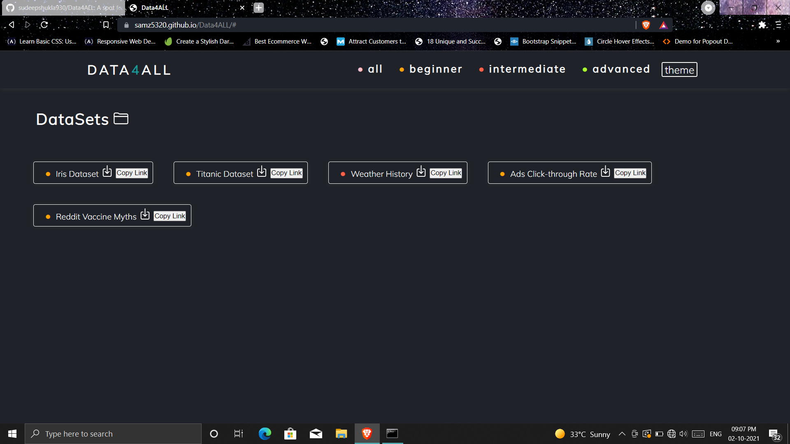

<h1 align=center>Data4ALL Website</h1>

## **About Us 😃:**
***
**DATA4ALL** is completely community driven website for providing free data sets to developers which can help them to develop exciting user driven application and make great impact to the world. 

<h3 align=center> <a href="https://samz5320.github.io/Data4ALL/"> Our Website 💻 </a></h3>

***

## **Features 😎🗻:**

Since, It is a fresh new project and still it in development phase.
we have following features :

  **1> You can filter out datasets with level :"Beginner , Intermediate ,Advanced".**
  
  **2> You can select theme of your choice : It can be Light or Dark.**
  
  **3> You can download the datasets.**
  
  **4> You can copy the link of datasets to share with others.**

***

## **Project Screenshots :**

<h3 align=center> Light Theme </h3>

<h3 align=center> Dark Theme </h3>

***

<h3 align="center"> Want To Add More 🤔??</h3>

**Lets Contribute to our project 🤝**

**Read the <a href = ./CONTRIBUTING.md>Contribution Guidlines</a> to follow smooth process**

***

### Drop in any datasets that you can find

1. Add your datasets file in the datasets folder
2. make changes in index.html

3. follow the comments for more help in the index.html file

4. test the changes in your localhost

5. if everything looks good ,go ahead and send a Pull Request.

6. Sit back and relax as your changes get reviewed.

7. Perform changes if any suggested 

***

<h2 align="center">Made With 💖 By Developers for YOU!</h2>

***
***

<!-- 
<h1 align=center>Data4ALL Website</h1>

***

<h3 align=center> <a href="https://samz5320.github.io/Data4ALL/"> Website!</a></h3>

### All the datasets you need in one place
<h2 align=center>What is Dataset?</h2>
  dataset is a collection of data which can be normally found in CSV files but that's not the only format. CSV files are meant to be comma separated list files which can be also in tabular form.

### Drop in any datasets that you can find

1. Add your datasets file in the datasets folder
2. make changes in index.html

3. follow the comments for more help in the index.html file

4. test the changes in your localhost

5. if everything looks good ,go ahead and send a Pull Request.

6. Sit back and relax as your changes get reviewed.

7. Perform changes if any suggested 

#### Thank you for contribution.

  

<h3>Have Fun❗</h3>

***

  

## Contributing To This Project:

### Make sure you read the [contributing.md](https://github.com/samz5320/Data4ALL/blob/main/CONTRIBUTING.md) file before contributing. Please be nice and respectful towards everyone. 

<h3 align="center">Made With 💖 By Developers for YOU!</h4> -->
